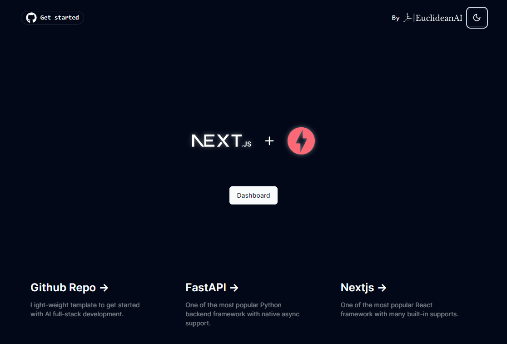

# Nextjs FastAPI Template

<!-- <a href="https://github.com/tiangolo/full-stack-fastapi-template/actions?query=workflow%3ATest" target="_blank"></a>
<a href="https://coverage-badge.samuelcolvin.workers.dev/redirect/tiangolo/full-stack-fastapi-template" target="_blank"></a> -->




Note: This is a fork from the original [Full Stack FastAPI Template](https://github.com/tiangolo/full-stack-fastapi-template "Full Stack FastAPI Template"). Instead of the original Reactjs frontend, we used Nextjs14 in this repository. 

Here are the reasons why we wanted to build with Nextjs (a full stack framework built on top of React) over React. 
- Dependencies reduction
A barebone Reactjs application would require installation of dependency packages to achieve multi-page routing, managing API requests, caching etc. There are a number of solutions out there, e.g. in the original repo, @tanstack/react-router is used for routing, @tanstack/react-query + axios are used for managing API requests and caching. 
In a Nextjs application, all these functions are built in without the need of third-party libraries. Also, Nextjs14 (app router) uses file-based routing which means the routing is automatically done via the folder structure. 

- Server side rendering 
Data fetching and mutation in a Nextjs application is mostly dealt in server side while client side data fetching is also allowed. This offers advantages to get away with 'useEffect' and other cumbersome boiler plate codes in order to do data feaching at client side. Server side rendering also offers performance benefit.

- Popularity 
Nextjs is getting more and more popular. There are good amount of frontend projects and Youtube tutorials based on Nextjs, which are beginner friendly. 

[](https://openapi-ts.pages.dev/openapi-fetch/ "Openapi-fetch")

Since Nextjs offers caching out-of-box (more caching details refer to [Nextjs caching](http://https://nextjs.org/docs/app/building-your-application/caching "Nextjs caching")), we don't have to use React Query, which is an awesome library to manage client side API requests but it has a little bit learning curve for beginners. Rather, the API requests can just be made via fetch (Nextjs added some improvement on the original javascript fetch function). We chose a very light-weight OpenAPI client library just to read the openapi specification file (saved as 'openapi.json') and make sure we have consistent and clearn code. 

Here is an example. 
First, in '/frontend/lib/api/index.ts' we initiate the API client. 

```javascript
import createClient from "openapi-fetch";
import type { paths } from "./v1";
import { cookies } from "next/headers";

const client = createClient<paths>({ baseUrl: process.env.API_BASE_URL, headers: { Authorization: `Bearer ${cookies().get("access_token")?.value}` } });
export default client;
```
then, on a server component, we can just do
```javascript
import client from "@/lib/api";
async function getItems() {
  const { data, error } = await client.GET("/api/v1/items/", {
    cache: "no-store",
  });
  if (error) {
    console.log(error);
	// any other error handling code
  }
  return data;
}
```
This is as cleanest as it can possibly get, in my personal opinion, for handling frontend API requests. 

### UI library 
We use [Shadcn](https://ui.shadcn.com/ "Shadcn"). Again, it's light-weight, all the UI components are imported as plain javascript code for transparency. So, you can modify to suit your need. 

### Roadmap
Updating the docker compose file to include nextjs bit at the moment and we are planning to cast a video on deployment, so stay tuned. 
A friendly warning is this code was recently written (in 3-4 days), so there are still bugs. All pull requests are welcome!

- Tidy up the error handling bit 
- Add task queue for long last jobs (Celery + Redis)
- AI chat interface

### Backend
We did not change the backend code, all the other details remain valid from the original [README](README-original.md)

### EuclideanAI
Who the hell is EuclideanAI? we are a boutique AI & Data consultancy who provide purpose-built AI, data, machine learning solutions for our clients. [Feel free to reach out!](https://euclideanai.com/contactus/) 

### License

The Nextjs FastAPI Template is licensed under the terms of the MIT license.
